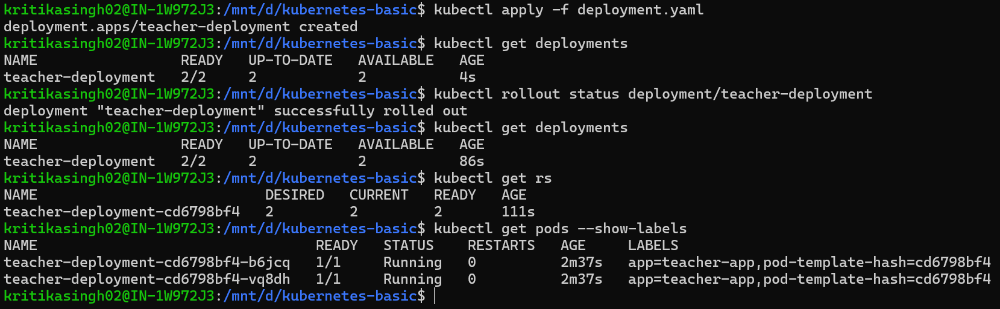
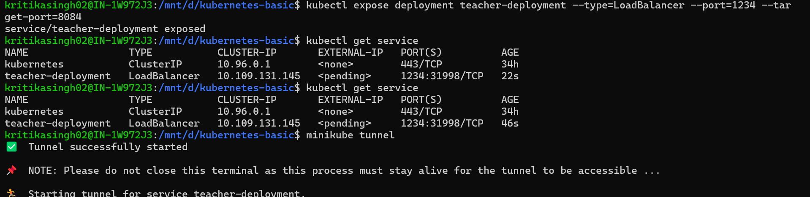
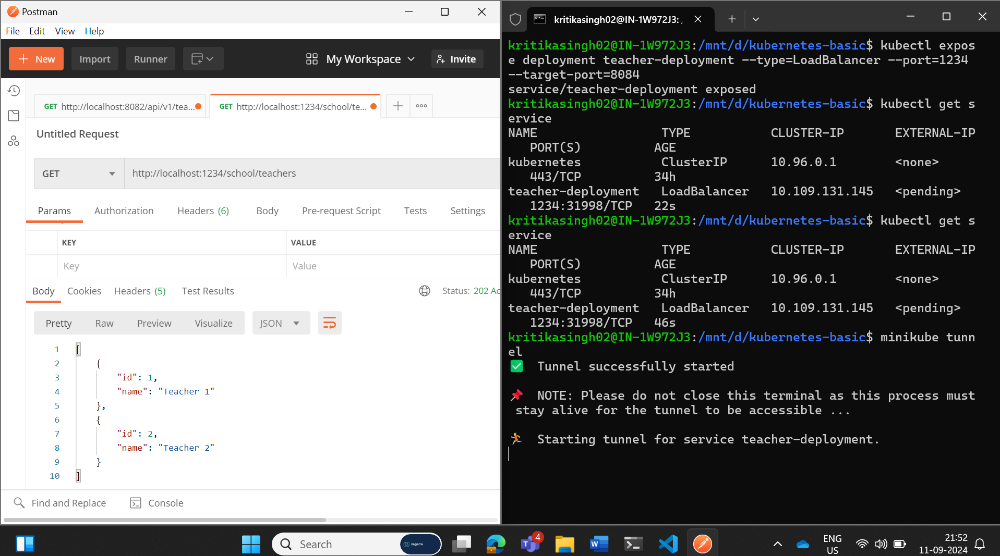
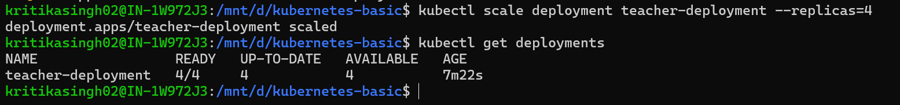
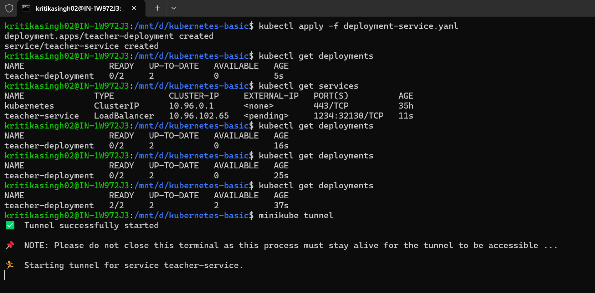
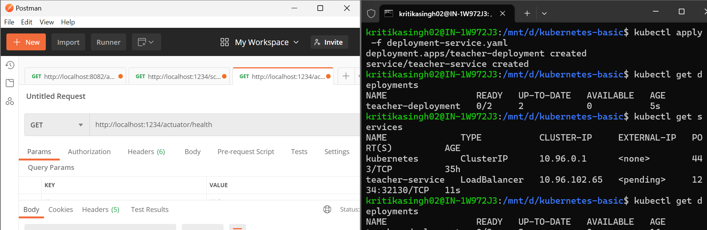
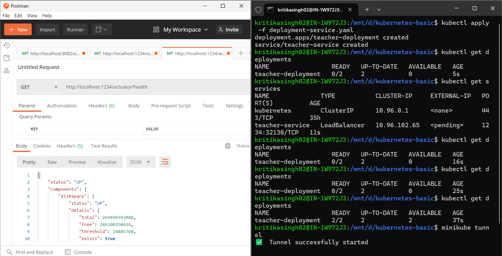
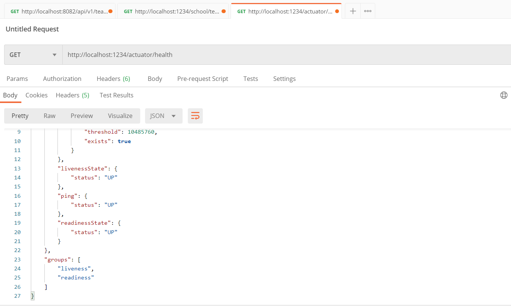

# Kubernetes Basic Assingment
1. Created one Springboot application that will show list of teachers.
2. API Url for teacher : http://localhost:8084/school/teacher
3. Application is Dockerize and I have created two docker images:
   - kritikasingh02/teacher:v1 
   - kritikasingh02/teacher:v3 (with health check endpoint for configuring liveness and readiness)

## Tech Stack:
1. Springboot
2. Docker
3. Kubectl
4. Minikube

## Project SetUp
1. clone git project - git clone https://github.com/kritika-singh-sengar/kubernetes-basic.git
2. Build Docker image:
   Open terminal: 
      > cd teacher
      > docker build -t teacher:v1 .
3. Tag Docker image:
   > docker tag teacher:v1 kritikasingh02/teacher:v1
4. Push Docker image to docker Hub:
   > docker login --username kritikasingh02
   > docker push kritikasingh02/teacher:v1

## Steps to run the application:

### Deployment Using YAML  
1. Start minikube and verify kubectl 
   > minikube start
   > kubectl cluster-info

2. Create the Deployment by running the following command:
   > kubectl apply -f deployment.yaml
   

3. To Verify the Deployment:
   > kubectl get deployments

4. To Delete the Deployment:
   > kubectl delete deployment teacher-deployment

5. Creates a Service of type LoadBalancer that routes external traffic on port 1234:
   > kubectl expose deployment teacher-deployment --type=LoadBalancer --port=1234 --target-port=8080
   

6. Get List of Services:
   > kubectl get services

7. To Delete the service:
   > kubectl delete service teacher-deployment

8. Run minikube tunnel:
   > minikube tunnel

9. Application is running on : http://localhost:1234/school/teachers
    

10. Scaling the application by increasing the number of replicas
    > kubectl scale deployment teacher-deployment --replicas=4
    

### Deployment and service exposure for health check endpoint
1. Start minikube and verify kubectl 
   > minikube start
   > kubectl cluster-info

2. Create the Deployment by running the following command:
   > kubectl apply -f deployment-service.yaml
     

3. Run minikube tunnel:
   > minikube tunnel

4. Application is running on : 
   - http://localhost:1234/school/teachers 
     

   - http://localhost:1234/actuator/health
     

     